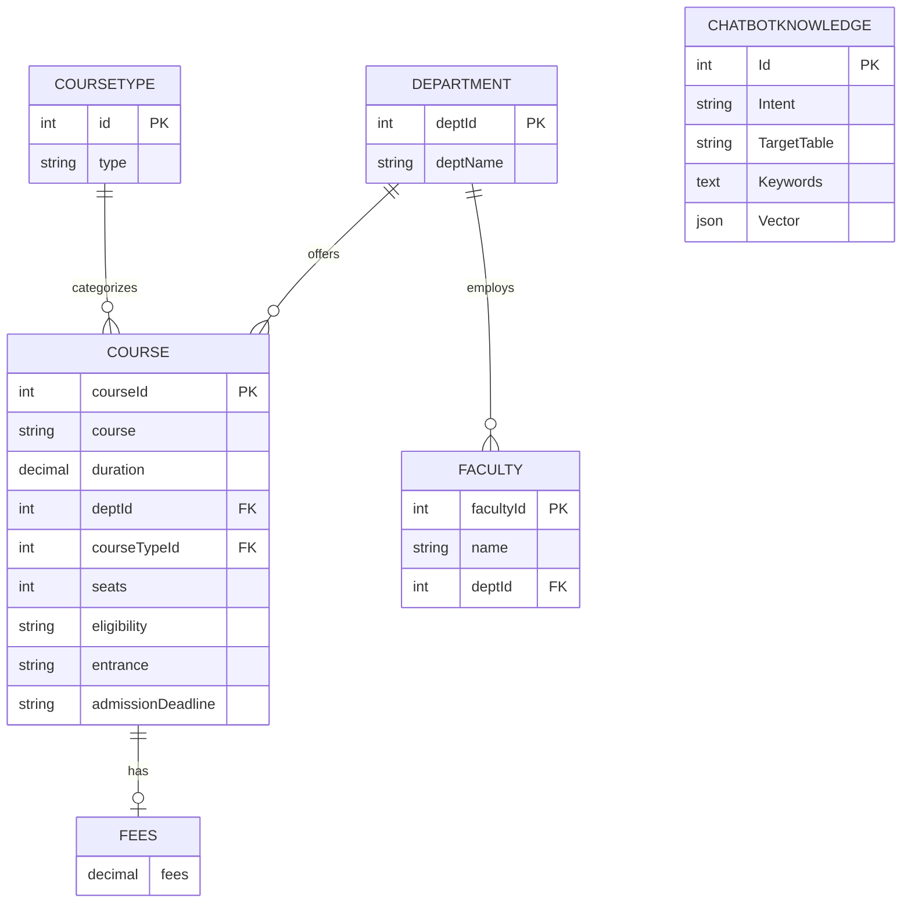

# 🎓 NPGC Assistant: Hybrid NLP Academic Chatbot

A high-performance, bilingual conversational agent designed for **National Post Graduate College (NPGC), Lucknow**.  
This system automates student inquiries regarding admissions, fee structures, NEP 2020 subject selections, and administrative processes.

---

## 📌 Project Overview

The **NPGC Assistant** addresses the problem of heavy student traffic at college administrative counters by providing instant, accurate responses.

Unlike generic chatbots, it uses a **Hybrid NLP Engine** that combines:
- Mathematical vector similarity
- Rule-based intent overrides

---

## 📸 Project UI

<p align="center">
  
  
  
</p>

<p align="center">
  
  
  
</p>

---

## ✨ Key Features

### 🔹 Hybrid NLP Engine
- Uses **Cosine Similarity (Vector Space Model)** for intent detection
- Applies **Regex-based rules** for high-priority administrative queries

### 🌐 Bilingual Core
- Supports:
  - English
  - Hindi (Devanagari)
  - Hinglish (Hindi in English script)

### 🎓 NEP 2020 Integration
- Helps students choose:
  - Minor Subjects
  - Vocational Courses
  - Co-curricular subjects

### 🏢 Administrative Routing
- Directs students to correct counters  
  *(e.g., "Go to Window No. 4 for ID Cards")*

### 💡 Smart UI/UX
- Autocomplete Typeahead
- Dynamic Placeholder Rotation
- Real-time Input Validation

### 🎤 Voice Enabled
- Speech-to-Text
- Text-to-Speech  
*(via Web Speech API)*

---

## 🧠 Technical Architecture

### 1️⃣ Vector Engine (Mathematical Model)

The chatbot converts user input into a **dimensional vector** using a custom vocabulary.

Similarity is calculated using:

```
Similarity = (A · B) / (||A|| ||B||)
```


Where:
- **A** = User input vector  
- **B** = Intent vector  

---

### 2️⃣ Context Management

Maintains stateful conversations using a `chatContext` system.

#### Features:
- **Memory Handling**
  - Remembers last selected course (e.g., BCA)
- **Follow-up Logic**
  - Handles one-word replies using `expectingFollowUp` flag

---

### 3️⃣ Normalization Layer

A powerful `COLLEGE_MAP` standardizes inputs:
- Converts slang & synonyms into tokens
- Supports 200+ mappings

#### Examples:
- `"vazifa"` → `"scholarship"`
- `"dakhila"` → `"admission"`

---

## ER Diagram 


<div align="center">


<p><b>ER Diagram for College Database</b></p>
</div>

---

## 📂 Folder Structure
```
├── config/ # Database configuration (mysql2)
├── constants/ # RESPONSE_VARIANTS & COLLEGE_MAP
├── controllers/ # Chat logic (handleChat)
├── jobs/ # vectorSyncJob (auto-generates vectors)
├── public/
│ ├── assets/ # Images & icons
│ ├── css/ # Responsive UI styles
│ └── js/ # app.js (logic), ui.js (UX features)
├── routes/ # API routes (Express)
├── service/ # EmbeddingService & rule detection
├── utils/ # findBestMatch & normalization logic
└── server.js # Entry point

```
---

## 🛠️ Installation & Setup

### 1️⃣ Clone Repository
```bash
git clone https://github.com/yourusername/npgc-assistant.git
cd npgc-assistant
```
### 2️⃣ Install Dependencies
```
npm install

```
### 3️⃣ Database Setup
- Create a MySQL database
- Import .sql schema from /docs
### 4️⃣ Configure Environment Variables
Create a .env file:
```
PORT=8080
DB_HOST=localhost
DB_USER=root
DB_PASS=yourpassword
DB_NAME=chatbot_db
SYNC_VECTORS=true
```
### 5️⃣ Run Server
```
npm start
```
📌 Note:
On first run, vectorSyncJob automatically generates embeddings for all intents.

---
## 🧪 Example Queries

The chatbot supports multilingual and context-aware queries across different formats:

### 💬 English
- "What are the fees for BCA?"
- "Tell me about admission process"
- "What is the last date to apply?"

### 💬 Hindi (Devanagari)
- "प्रवेश की अंतिम तिथि क्या है?"
- "बीसीए की फीस कितनी है?"
- "आईडी कार्ड कहाँ से बनेगा?"

### 💬 Hinglish (Roman Hindi)
- "Minor subject kaise choose kare?"
- "BCA admission ka process kya hai?"
- "Scholarship kaise milega?"

### 🏢 Administrative Queries
- "ID card window number?"
- "Fee submission counter?"
- "Migration certificate kaha milega?"

---

## 🚀 Future Roadmap

The project is designed to evolve into a full-scale academic assistant platform:

- 📱 **WhatsApp API Integration**  
  Enable chatbot access directly through WhatsApp for wider reach.

- 🎓 **Student Portal Integration**  
  Allow students to:
  - Check attendance  
  - View marks  
  - Access personal academic data  

- 📄 **OCR-Based Document Verification**  
  Automatically verify student documents in real-time using OCR technology.

- 🤖 **AI Personalization (Planned)**  
  Personalized responses based on student history and preferences.

---

## 👨‍💻 Author

**Krishna Agarwal**  
Backend Developer (Java / Spring Boot)

- 🔗 LinkedIn: https://linkedin.com/in/kr254na  
- 🔗 GitHub: https://github.com/kr254na

---

## 📜 License

This project is licensed under the **MIT License**.  
You are free to use, modify, and distribute this software with proper attribution.

---

## ⭐ Support

If you found this project useful:

- ⭐ Star this repository on GitHub  
- 🍴 Fork it to contribute  
- 🛠️ Submit issues or feature requests  

---

## 🙌 Acknowledgement

Special thanks to:
- NPGC administration for domain insights  
- Contributors and testers who helped refine the chatbot  

---

## 📬 Contact

For queries or collaboration:

📧 Email: krishnaagarwal0193@gmail.com  

---
